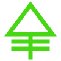
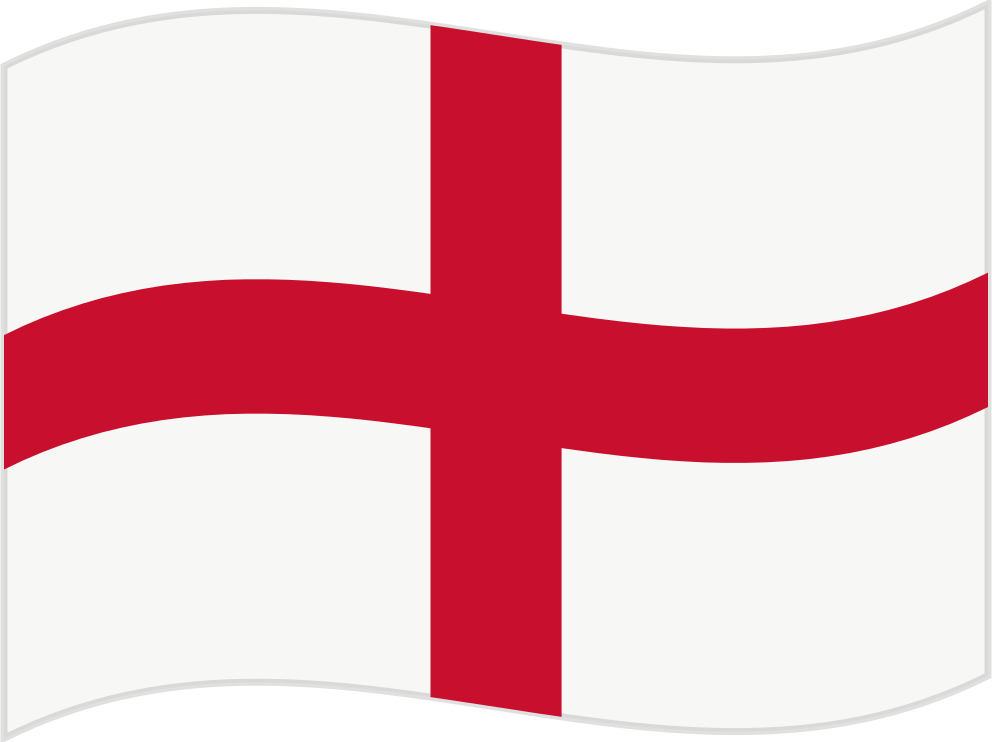
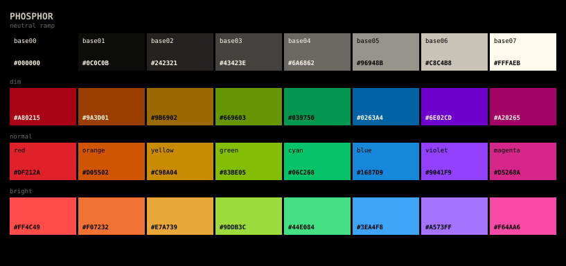
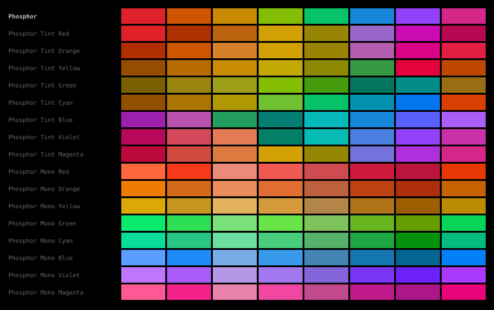

<!--
README.md
@guterion
CC-BY-SA-4.0
Project landing page, palette reference and language selector
-->

<div align="center">



# Phosphor

**A terminal colour palette with a warm neutral ramp and a green lean**

OKLCH · Base16 · Base24 · 17 variants · 32 colours

<a href="LICENCE.md"></a>


</div>

---

## 🌐 Select your language

-  **[Latina](i18n/la/README.md)**
-  **[Español](i18n/es/README.md)**
-  **[English](i18n/en/README.md)**

The documentation in each language covers the palette, the variants, the
standards mapping and the build. This page carries the colours themselves.

---

<div align="center">



</div>

## Copy the colours

**Neutral ramp, base00 to base07**

```
#000000 #0C0C0B #242321 #43423E #6A6862 #96948B #C8C4B8 #FFFAEB
```

**Accents, normal tone, base08 to base0F**

```
#DF212A #D05502 #C98A04 #83BE05 #06C268 #1687D9 #9041F9 #D5268A
```

**Accents, bright tone, the bright ANSI half**

```
#FF4C49 #E7A739 #9DDB3C #44E084 #3EA4F8 #A573FF
```

<details>
<summary><b>Base24 scheme</b></summary>

```yaml
system: "base24"
name: "Phosphor"
author: "@guterion"
slug: "phosphor"
variant: "dark"
palette:
  base00: "#000000"
  base01: "#0C0C0B"
  base02: "#242321"
  base03: "#43423E"
  base04: "#6A6862"
  base05: "#96948B"
  base06: "#C8C4B8"
  base07: "#FFFAEB"
  base08: "#DF212A"
  base09: "#D05502"
  base0A: "#C98A04"
  base0B: "#83BE05"
  base0C: "#06C268"
  base0D: "#1687D9"
  base0E: "#9041F9"
  base0F: "#D5268A"
  base10: "#000000"
  base11: "#000000"
  base12: "#FF4C49"
  base13: "#E7A739"
  base14: "#9DDB3C"
  base15: "#44E084"
  base16: "#3EA4F8"
  base17: "#A573FF"
```

</details>

<details>
<summary><b>CSS custom properties</b></summary>

```css
:root {
  --ph-base00: #000000;  --ph-base04: #6A6862;
  --ph-base01: #0C0C0B;  --ph-base05: #96948B;
  --ph-base02: #242321;  --ph-base06: #C8C4B8;
  --ph-base03: #43423E;  --ph-base07: #FFFAEB;

  --ph-red-dim:     #A80215;  --ph-red-normal:     #DF212A;  --ph-red-bright:     #FF4C49;
  --ph-orange-dim:  #9A3D01;  --ph-orange-normal:  #D05502;  --ph-orange-bright:  #F07232;
  --ph-yellow-dim:  #9B6902;  --ph-yellow-normal:  #C98A04;  --ph-yellow-bright:  #E7A739;
  --ph-green-dim:   #669603;  --ph-green-normal:   #83BE05;  --ph-green-bright:   #9DDB3C;
  --ph-cyan-dim:    #039750;  --ph-cyan-normal:    #06C268;  --ph-cyan-bright:    #44E084;
  --ph-blue-dim:    #0263A4;  --ph-blue-normal:    #1687D9;  --ph-blue-bright:    #3EA4F8;
  --ph-violet-dim:  #6E02CD;  --ph-violet-normal:  #9041F9;  --ph-violet-bright:  #A573FF;
  --ph-magenta-dim: #A20265;  --ph-magenta-normal: #D5268A;  --ph-magenta-bright: #F64AA6;
}
```

The full stylesheet, with every variant, is at
[`dist/css/phosphor.css`](dist/css/phosphor.css). Every variant with its OKLCH
and contrast figures is at [`dist/json/phosphor.json`](dist/json/phosphor.json).

</details>

---

## The palette

<!-- palette:start -->
| slot | hex | role | okL | okC | okH | on base00 | on base01 |
| --- | --- | --- | --- | --- | --- | --- | --- |
| base00 |  `#000000` | background | 0.000 | 0.000 | — | — | 1.07:1 |
| base01 |  `#0C0C0B` | status bars | 0.154 | 0.002 | 106.6° | 1.07:1 | — |
| base02 |  `#242321` | selection | 0.256 | 0.004 | 84.6° | 1.34:1 | 1.25:1 |
| base03 |  `#43423E` | comments | 0.379 | 0.007 | 95.2° | 2.09:1 | 1.95:1 |
| base04 |  `#6A6862` | dark foreground | 0.517 | 0.010 | 91.6° | 3.77:1 | 3.51:1 |
| base05 |  `#96948B` | foreground | 0.666 | 0.013 | 96.5° | 6.91:1 | 6.44:1 |
| base06 |  `#C8C4B8` | light foreground | 0.820 | 0.017 | 91.6° | 12.04:1 | 11.22:1 |
| base07 |  `#FFFAEB` | lightest | 0.985 | 0.020 | 91.6° | 20.13:1 | 18.76:1 |

| family | dim | normal | bright | okL | okC | okH | on base01 |
| --- | --- | --- | --- | --- | --- | --- | --- |
| red |  `#A80215` |  `#DF212A` |  `#FF4C49` | 0.580 | 0.220 | 26.0° | 4.09:1 |
| orange |  `#9A3D01` |  `#D05502` |  `#F07232` | 0.601 | 0.172 | 44.6° | 4.64:1 |
| yellow |  `#9B6902` |  `#C98A04` |  `#E7A739` | 0.679 | 0.142 | 76.3° | 6.64:1 |
| green |  `#669603` |  `#83BE05` |  `#9DDB3C` | 0.733 | 0.192 | 128.6° | 8.70:1 |
| cyan |  `#039750` |  `#06C268` |  `#44E084` | 0.714 | 0.183 | 152.9° | 8.32:1 |
| blue |  `#0263A4` |  `#1687D9` |  `#3EA4F8` | 0.607 | 0.155 | 247.5° | 5.13:1 |
| violet |  `#6E02CD` |  `#9041F9` |  `#A573FF` | 0.580 | 0.253 | 297.3° | 4.02:1 |
| magenta |  `#A20265` |  `#D5268A` |  `#F64AA6` | 0.587 | 0.222 | 352.0° | 4.17:1 |
<!-- palette:end -->

---

## Variants

One full palette, eight Tint variants and eight Mono variants. A Tint leans the
whole scheme towards one hue. A Mono holds one hue across every chromatic slot
and separates the families by lightness alone.



<!-- variants:start -->
| variant | scheme | strength |
| --- | --- | --- |
| Phosphor | `phosphor` | — |
| Phosphor Tint Red | `phosphor-tint-red` | 0.425 |
| Phosphor Tint Orange | `phosphor-tint-orange` | 0.519 |
| Phosphor Tint Yellow | `phosphor-tint-yellow` | 0.595 |
| Phosphor Tint Green | `phosphor-tint-green` | 0.639 |
| Phosphor Tint Cyan | `phosphor-tint-cyan` | 0.279 |
| Phosphor Tint Blue | `phosphor-tint-blue` | 0.460 |
| Phosphor Tint Violet | `phosphor-tint-violet` | 0.261 |
| Phosphor Tint Magenta | `phosphor-tint-magenta` | 0.319 |
| Phosphor Mono Red | `phosphor-mono-red` | — |
| Phosphor Mono Orange | `phosphor-mono-orange` | — |
| Phosphor Mono Yellow | `phosphor-mono-yellow` | — |
| Phosphor Mono Green | `phosphor-mono-green` | — |
| Phosphor Mono Cyan | `phosphor-mono-cyan` | — |
| Phosphor Mono Blue | `phosphor-mono-blue` | — |
| Phosphor Mono Violet | `phosphor-mono-violet` | — |
| Phosphor Mono Magenta | `phosphor-mono-magenta` | — |
<!-- variants:end -->

Each variant ships as a Base16 and a Base24 scheme, in
[`schemes/`](schemes/).

---

## Install

Copy a scheme from [`schemes/base24/`](schemes/base24/) into the tool that reads
Base24 schemes, or take the hex values from the blocks above.

Application themes come from the [tinted-theming][tt] builder. Point it at a
scheme file here and it produces the theme for Alacritty, Kitty, WezTerm,
Neovim, tmux and the rest, from templates their maintainers keep current.

[tt]: https://github.com/tinted-theming/home

## Build

```sh
uv run scripts/generate.py    # rewrite schemes/, dist/, assets/ and the tables
uv run scripts/validate.py    # check the source and everything generated
```

[`src/phosphor.yaml`](src/phosphor.yaml) is the only file a person edits.

## Contribute

[CONTRIBUTING.md](CONTRIBUTING.md) holds the constraints a colour proposal works
inside, the commit conventions and the translation rules.

## Licence

[CC-BY-SA-4.0 or later](LICENCE.md), by [@guterion](https://github.com/guterion).
