<!--
i18n/es/README.md
@fraxgut
CC-BY-SA-4.0
Spanish documentation for the Phosphor palette
-->

# Phosphor

> 🌐 **Idioma:** [Latina](../la/README.md) · **Español** · [English](../en/README.md)

Paleta de colores para terminal, construida sobre una rampa neutra cálida y
ocho familias cromáticas saturadas, con una inclinación verde. Se publica en
diecisiete variantes, como esquemas Base16 y Base24.

## La paleta

La paleta canónica tiene 32 colores: ocho neutros y ocho familias cromáticas,
cada una con un tono tenue, uno normal y uno vivo.

<!-- palette:start -->
| ranura | hex | okL | contraste sobre base00 |
| --- | --- | --- | --- |
| base00 | 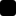 `#000000` | 0.000 | — |
| base01 |  `#0C0C0B` | 0.154 | 1.07:1 |
| base02 |  `#242321` | 0.256 | 1.34:1 |
| base03 |  `#43423E` | 0.379 | 2.09:1 |
| base04 |  `#6A6862` | 0.517 | 3.77:1 |
| base05 | 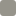 `#96948B` | 0.666 | 6.91:1 |
| base06 | 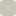 `#C8C4B8` | 0.820 | 12.04:1 |
| base07 | 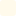 `#FFFAEB` | 0.985 | 20.13:1 |

| familia | tenue | normal | vivo | okL | okC | okH | contraste sobre base01 |
| --- | --- | --- | --- | --- | --- | --- | --- |
| red |  `#A80215` | 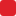 `#DF212A` |  `#FF4C49` | 0.580 | 0.220 | 26.0° | 4.09:1 |
| orange | 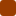 `#9A3D01` | 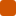 `#D05502` |  `#F07232` | 0.601 | 0.172 | 44.6° | 4.64:1 |
| yellow | 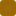 `#9B6902` | 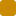 `#C98A04` | 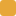 `#E7A739` | 0.679 | 0.142 | 76.3° | 6.64:1 |
| green | 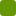 `#669603` |  `#83BE05` | 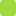 `#9DDB3C` | 0.733 | 0.192 | 128.6° | 8.70:1 |
| cyan |  `#039750` | 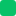 `#06C268` | 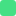 `#44E084` | 0.714 | 0.183 | 152.9° | 8.32:1 |
| blue |  `#0263A4` |  `#1687D9` |  `#3EA4F8` | 0.607 | 0.155 | 247.5° | 5.13:1 |
| violet | 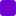 `#6E02CD` | 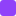 `#9041F9` | 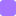 `#A573FF` | 0.580 | 0.253 | 297.3° | 4.02:1 |
| magenta | 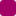 `#A20265` | 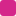 `#D5268A` |  `#F64AA6` | 0.587 | 0.222 | 352.0° | 4.17:1 |
<!-- palette:end -->

## Diseño

### El núcleo verde

Tres matices están fijos y sostienen la identidad del esquema: el amarillo en
OKLCH 76,3°, el verde lima en 128,6° y el verde primavera en 152,9° al que el
esquema llama cian. El nombre viene de la ranura ANSI que ocupa el color; el
color es un verde primavera y es deliberado.

Por eso dos acentos quedan a 24° entre sí dentro de la banda verde, y la rueda
guarda un hueco de 94° donde iría un cian. Esa densidad es la firma de la
paleta. El esquema se inclina al verde y la rampa neutra se inclina al cálido:
esas dos cosas juntas son Phosphor.

### Los otros cinco matices

El rojo, el naranja, el azul, el violeta y el magenta los sitúa una búsqueda
con restricciones. La búsqueda maximiza la distancia mínima entre dos acentos
cualesquiera y mantiene cada matiz dentro de la banda que ocupa su nombre, de
modo que cada familia conserva su nombre.

La distancia mínima entre dos acentos es de **0,082 ΔE**, entre el verde y el
cian. Ambos están fijos, así que esa cifra es el techo que imponen las anclas.

### Luminosidad perceptual

Cada color se diseña en OKLCH, donde un cambio en el número de luminosidad
corresponde a un cambio en la luminosidad que se ve. Los acentos abarcan 0,20
de luminosidad OKLab, lo que los mantiene distintos entre sí y distintos de la
rampa neutra que tienen detrás.

Los tonos tenue y vivo están a −0,12 y +0,09 del tono normal en esa misma
luminosidad. Los tonos vivos ocupan la mitad ANSI brillante que define Base24.

### Contraste

Los acentos son colores de sintaxis, así que el piso es la razón de 3:1 que
WCAG fija para el texto grande y para los componentes de interfaz. El generador
trata ese piso como una restricción: sube la luminosidad de cualquier color que
quede por debajo. Cinco de los ocho acentos superan además 4,5:1, y esos cinco
sirven para texto corrido.

## Tint

Un Tint gira todos los matices una parte del camino hacia un objetivo, de
manera que el esquema completo se inclina hacia una familia sin perder su
variedad.

Una ranura girada puede cambiar de identidad, y el color nuevo debe ser
pariente del que reemplazó. La ranura roja admite un café, un naranja o un
púrpura. La ranura verde admite un verde amarillento, un cian o un azul.
`src/phosphor.yaml` registra el arco que puede ocupar cada familia, y
`scripts/validate.py` somete a él todas las variantes.

La intensidad de un Tint es derivada. Es el giro máximo que mantiene las ocho
ranuras emparentadas con su origen y conserva las familias al menos a tres
cuartos de la separación que alcanza la paleta completa. Por eso cada variante
llega a su propia intensidad, y la regla que la detiene cambia:

| variante | intensidad | detenida por |
| --- | --- | --- |
| Tint Green | 0,639 | piso de separación |
| Tint Yellow | 0,595 | el violeta sale de su arco |
| Tint Orange | 0,519 | el verde sale de su arco |
| Tint Blue | 0,460 | el amarillo sale de su arco |
| Tint Red | 0,425 | el verde sale de su arco |
| Tint Magenta | 0,319 | el verde sale de su arco |
| Tint Cyan | 0,279 | piso de separación |
| Tint Violet | 0,261 | el amarillo sale de su arco |

El giro acerca los matices entre sí, así que una segunda pasada reparte la
luminosidad de las ranuras que se movieron. La luminosidad carga con la
separación que cede el matiz.

## Mono

Una variante Mono mantiene un solo matiz en todas las ranuras cromáticas,
dentro de una deriva de ±10°, y separa las familias semánticas solo por
luminosidad y croma OKLab. Mono Green toma el matiz de `#47D813`.

Ocho papeles dentro de un matiz quedan más juntos que ocho papeles repartidos
por la rueda: el par más cercano de una variante Mono mide unos 0,031 ΔE, frente
a 0,082 de la paleta completa. Un Mono compra coherencia y paga en
distinguibilidad. Eso pertenece a la monocromía misma, y `scripts/validate.py`
lo informa.

## Variantes

<!-- variants:start -->
| variante | esquema | intensidad |
| --- | --- | --- |
| Phosphor | `phosphor` | — |
| Phosphor Tint Red | `phosphor-tint-red` | 0.425 |
| Phosphor Tint Orange | `phosphor-tint-orange` | 0.519 |
| Phosphor Tint Yellow | `phosphor-tint-yellow` | 0.595 |
| Phosphor Tint Green | `phosphor-tint-green` | 0.639 |
| Phosphor Tint Cyan | `phosphor-tint-cyan` | 0.279 |
| Phosphor Tint Blue | `phosphor-tint-blue` | 0.460 |
| Phosphor Tint Violet | `phosphor-tint-violet` | 0.261 |
| Phosphor Tint Magenta | `phosphor-tint-magenta` | 0.319 |
| Phosphor Mono Red | `phosphor-mono-red` | — |
| Phosphor Mono Orange | `phosphor-mono-orange` | — |
| Phosphor Mono Yellow | `phosphor-mono-yellow` | — |
| Phosphor Mono Green | `phosphor-mono-green` | — |
| Phosphor Mono Cyan | `phosphor-mono-cyan` | — |
| Phosphor Mono Blue | `phosphor-mono-blue` | — |
| Phosphor Mono Violet | `phosphor-mono-violet` | — |
| Phosphor Mono Magenta | `phosphor-mono-magenta` | — |
<!-- variants:end -->

## Estándares

`src/phosphor.yaml` es la paleta canónica. Base16 y Base24 son
representaciones de compatibilidad generadas a partir de ella.

**Base24** tiene dieciocho ranuras, de base00 a base17, e incluye los colores
ANSI brillantes. Los tres tonos se corresponden con ella de forma directa.

**Base16** tiene dieciséis. Dos de ellas guardan un color que la especificación
nombra de otra manera: base0E guarda el violeta donde la especificación dice
magenta, y base0F guarda el magenta donde dice rojo oscuro o café. Phosphor
mantiene ocho familias cromáticas y Base16 tiene sitio para seis más un
naranja, así que la correspondencia queda escrita en `src/phosphor.yaml`, bajo
`mapping`.

## Formatos

| ruta | contenido |
| --- | --- |
| `src/phosphor.yaml` | la paleta canónica y todas las reglas de derivación |
| `schemes/base16/` | 17 esquemas Base16 |
| `schemes/base24/` | 17 esquemas Base24 |
| `dist/json/phosphor.json` | cada variante, con sus cifras OKLCH y de contraste |
| `dist/css/phosphor.css` | propiedades personalizadas, un bloque por variante |
| `assets/` | las imágenes de la paleta y las muestras |

Los temas de aplicación salen del constructor de [tinted-theming][tt]. Apúntelo
a un archivo de esquema de aquí y produce el tema para Alacritty, Kitty,
WezTerm, Neovim, tmux y los demás, desde plantillas que mantienen al día sus
responsables.

[tt]: https://github.com/tinted-theming/home

## Uso

Copie un esquema de `schemes/base24/` en la herramienta que lea esquemas
Base24, o tome los valores hexadecimales de `dist/json/phosphor.json`.

Para una página web, enlace la hoja de estilos y nombre la variante en el
elemento raíz:

```html
<link rel="stylesheet" href="dist/css/phosphor.css">
<html data-phosphor="phosphor-tint-green">
```

La paleta completa está definida en `:root` a secas, de modo que una página que
no nombre ninguna variante recibe Phosphor.

## Compilación

Los guiones necesitan [uv][uv]. Cada uno declara sus propias dependencias, así
que el entorno no requiere preparación.

```sh
uv run scripts/generate.py    # reescribe schemes/, dist/, assets/ y las tablas
uv run scripts/validate.py    # revisa la fuente y todo lo generado
```

`src/phosphor.yaml` es el único archivo que se edita a mano. La generación es
determinista: ejecútela dos veces sin editar y el árbol de trabajo queda
limpio.

El validador revisa la sintaxis hexadecimal, los colores repetidos, la gama
sRGB, el ascenso de la rampa neutra, los matices ancla, la separación de
acentos de cada variante, los arcos de parentesco de cada Tint, el piso de
contraste y la cobertura de ranuras en los 34 archivos de esquema.

[uv]: https://docs.astral.sh/uv/

## Contribuir

Abra un issue antes de proponer un color e incluya las medidas: las cifras
OKLCH, el contraste sobre base01 y la distancia a los acentos vecinos. Un
cambio que mejora un número y deja la paleta peor a la vista no es una mejora.

Edite `src/phosphor.yaml` y ejecute el generador. Un pull request que modifique
un archivo generado recibe en su lugar la edición equivalente en la fuente.

## Licencia

[CC-BY-SA-4.0 o posterior](../../LICENCE.md), por
[@fraxgut](https://github.com/fraxgut).
